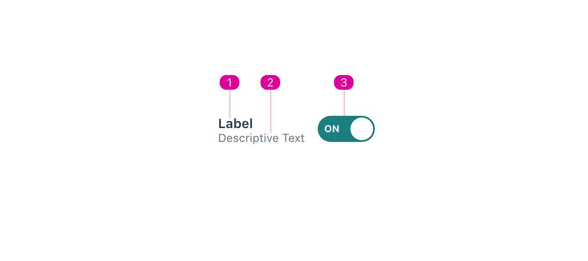

# Switch

> A switch allows a user to immediately turn an option on or off.

## Anatomy

1. Label
2. Description (optional)
3. Control

## Style

The standard switch has two states: "on" and "off," which are conveyed by a switch control moving right and left.

<button class="switch" type="button" role="switch" aria-checked="true">Switch</button>
<button class="switch" type="button" role="switch" aria-checked="false">Switch</button>

### State Indicator

An internal `.switch__state` can be used to display a value for the switch's current state.
This is highly recommended to remove any ambiguity about which state is on and which is off.

<button class="switch" type="button" role="switch" aria-checked="true">
  
ON

  Switch
</button>
<button class="switch" type="button" role="switch" aria-checked="false">
  
OFF

  Switch
</button>

## Usage

- When a user toggles a switch, its corresponding action takes effect right away.
- A switch has two mutually exclusive states&mdash;on and off.

::: tip Dos:

- Do use a switch to mimic a physical on/off switch in the interface.
- Do allow users to select the switch by clicking the control or its text label.
- Do position the switch to the left of its text label by default.

:::

::: danger Don’ts:

- Don’t use the words “on/off” in the switch’s text label. The option that the switch controls should be clear from its label. A tooltip/title attribute may be added to convey the on/off state.
- Don’t use a switch if the option is part of a larger flow, with a final confirmation step or Submit button. Use a [checkbox](checkbox) instead.
- Don’t use a switch if users can select multiple options from a list. Use [checkboxes](checkbox) instead.

:::

